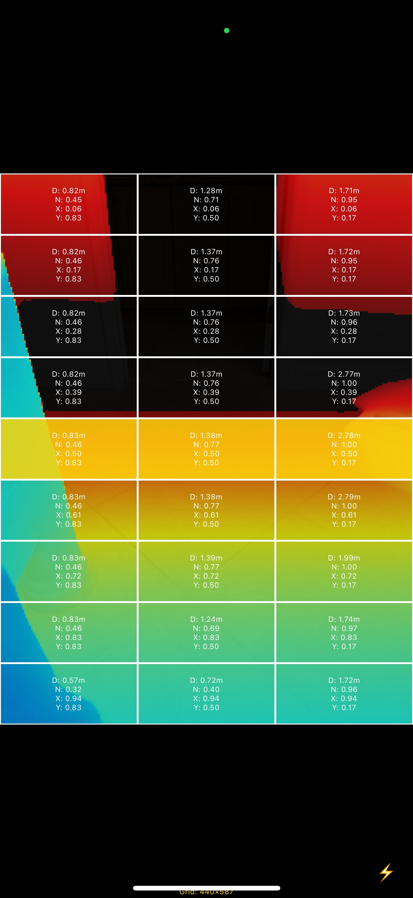
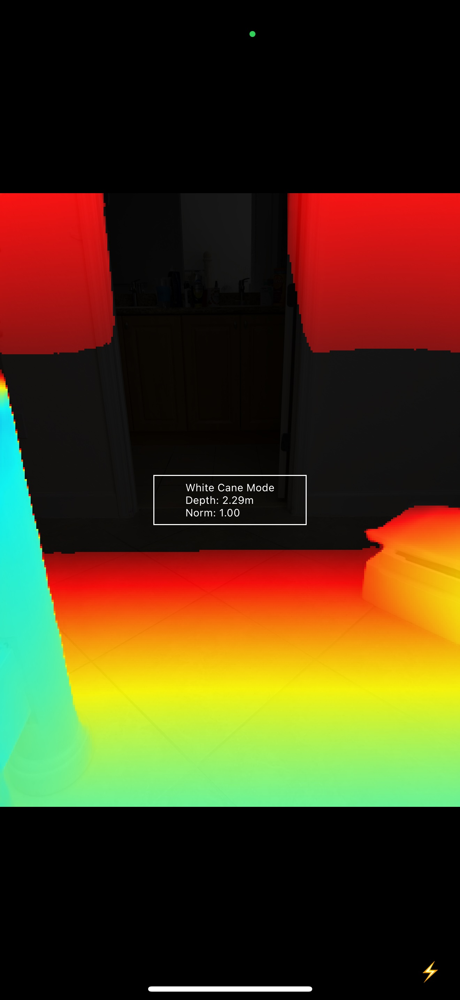
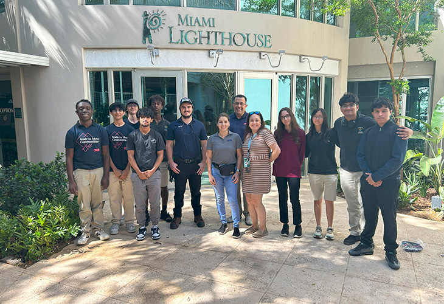

# Iris - LiDAR Assisted Navigation App

## About the Project

Iris is an innovative iOS application designed to assist visually impaired users by converting LiDAR depth data into musical notes. The app was developed by students from Pembroke Pines Charter High School in Pembroke Pines, Florida, as part of the Made to Move Communities (MTMC) challenge by Otis, which they won at the Regional level in 2025.

Made to Move Communities is a global STEM education program launched by Otis Elevator in 2020 that engages students to develop innovative mobility solutions for underserved communities. In its fifth year, the program focused on AI-driven inclusive mobility solutions, which led to the creation of Iris.

<p align="center">
  <a href="https://youtube.com/shorts/wNBKJqATEvs">
    
  </a>
</p>

## Features

- **White Cane Mode**: Central rectangle displaying real-time LiDAR depth data with audio feedback
- **Depth Table Mode**: Activated by upward swipe, shows a 3×9 grid with depth values and coordinates
- **Single Up Scan**: Sequential audio playback from bottom to top of center column
- **Full Up Scan**: Plays all instruments in each row simultaneously from bottom to top
- **Sectored Audio Feedback**: Different instruments for left, center, and right sectors of the screen
- **Stereo Panning**: Enhances spatial orientation through directional audio

<p align="center">
  <a href="https://youtube.com/shorts/CtDEEJle-3M?si=54tnBxbq3wxWBd3G">
    
  </a>
</p>

## How It Works

Iris uses the iPhone's LiDAR sensor to detect objects in the environment and translates distance information into musical notes. Different depths correspond to different notes, creating an audible representation of the physical space around the user:

1. Closer objects produce higher-pitched notes (C8)
2. Farther objects produce lower-pitched notes (C1)
3. Different screen sections play different instruments (Harp, Piano, Synth Pad)
4. Audio panning enhances directional awareness

<p align="center">
  
  
</p>

## Technology

- **LiDAR Integration**: Based on Apple's "Capturing Depth Using the LiDAR Camera" sample code
- **Metal Framework**: For efficient depth data processing
- **AVFoundation**: For audio generation and spatial positioning
- **SoundFont Technology**: For high-quality instrument sounds
- **SwiftUI**: For the user interface

## Getting Started

### Prerequisites

- iPhone 12 Pro, iPhone 13 Pro, or newer models with LiDAR sensor
- iOS 15.0 or later

### Installation

Clone the repository and open the Xcode project:

```bash
git clone https://github.com/mariovpereira/iris.git
cd iris
open Iris.xcodeproj
```

Build and run the application on your LiDAR-enabled device.

## Usage

1. **White Cane Mode** (Default): Point the device at objects to hear musical notes corresponding to distance
2. **Swipe Up**: Enter Depth Table mode to visualize the depth grid
3. **Single Tap**: In Table mode, activates Single Up Scan with sequential notes
4. **Double Tap**: In Table mode, activates Full Up Scan with all sectors playing at once
5. **Swipe Down**: Return to White Cane mode from any other mode

## Project Team

### Students from Pembroke Pines Charter High School
1. Mia Fu (12th grade)
2. Steve Jacob (11th grade)
3. Emiliano Salgado (12th grade)
4. Matthew Sainitulus (12th grade)
5. Reuben Sherry (12th grade)
6. Chinedu Opkala (12th grade)
7. Max Wyborny (12th grade)
8. Umer Qureshi (10th grade)
9. Caitlin Estevez (9th grade)

### Teacher
- Ms. Darlene Laffler

<p align="center">
  
</p>

## Acknowledgements

We extend our sincere appreciation and gratitude to:

- **Miami Lighthouse for the Blind** for their invaluable feedback and guidance throughout the development process.
- **Anthropic** for granting us access to Claude Code, which made this project come together efficiently and effectively.
- **Otis** for creating the Made to Move Communities challenge that inspired this project.

## License

This project is licensed under multiple licenses:

- **Iris Application**: MIT License (see `/Iris/LICENSE.txt`)
- **LiDAR Depth Code**: Based on Apple's sample code, MIT Licensed
- **AudioKit Libraries**: MIT License
- **SoundFont Files**: MIT License

For full license details, see the LICENSE files in the repository.

## Contact

For questions or feedback about Iris, please [open an issue](https://github.com/mariovpereira/iris/issues) on this repository.
